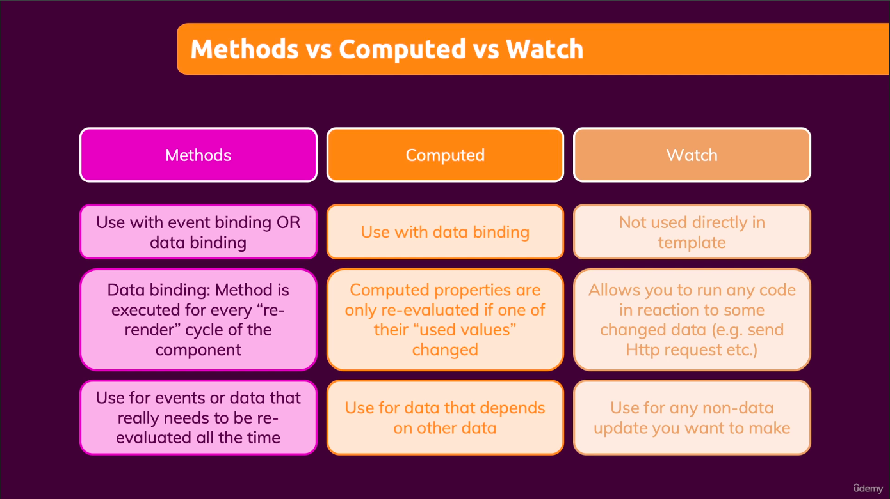
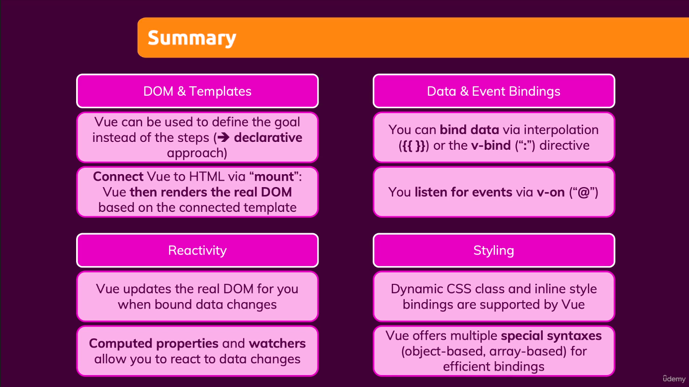
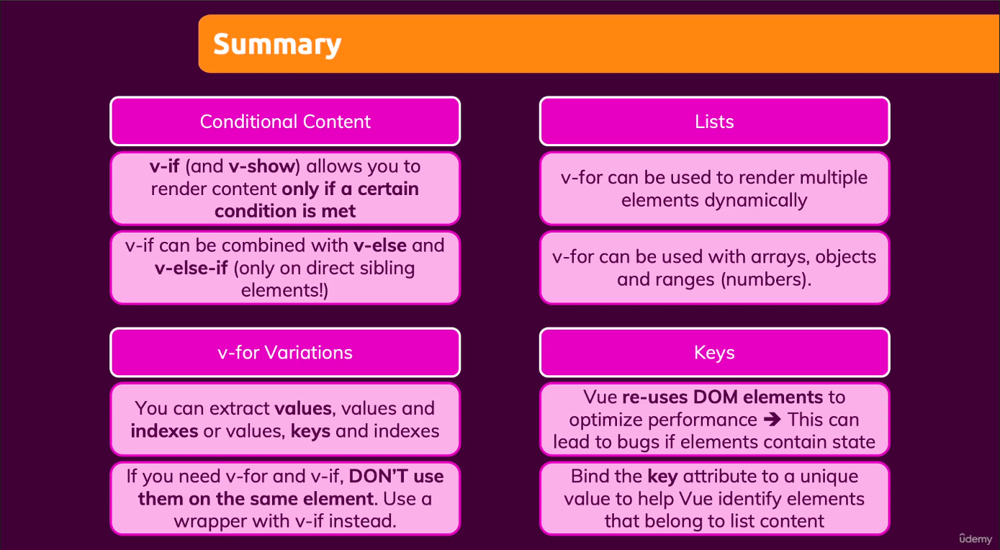
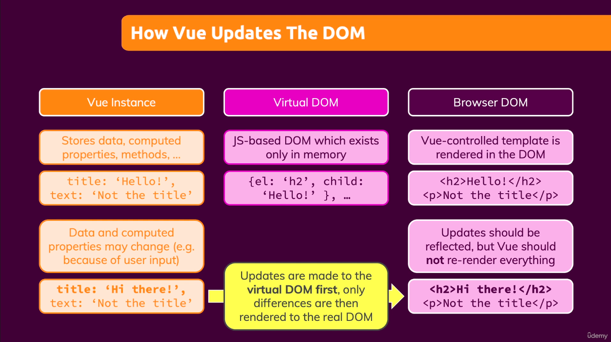
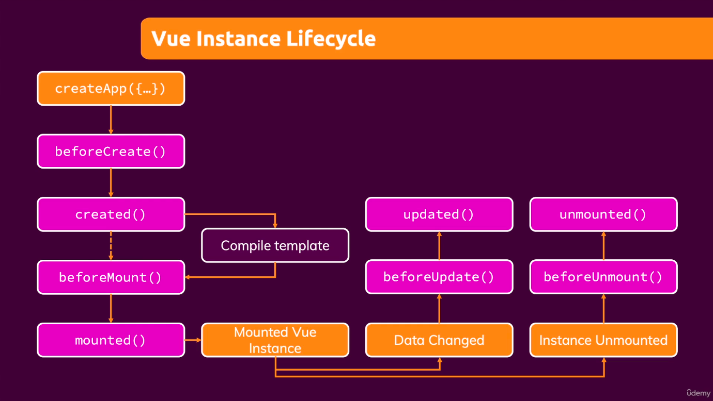
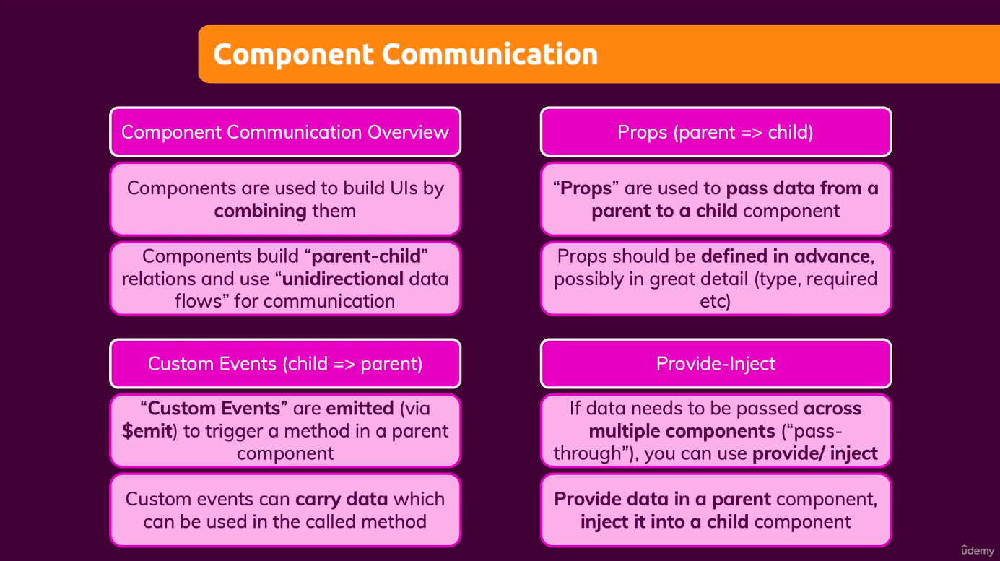
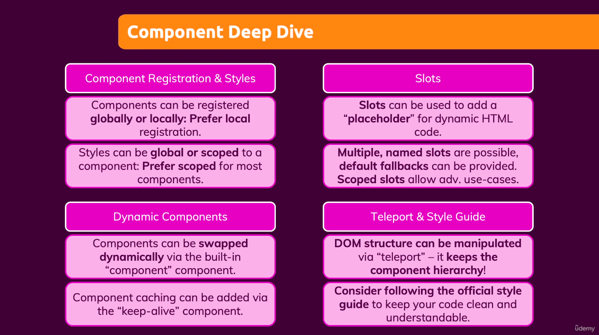

# Udemy - Vue.js - The full guide

I'm currently following ["Vue - The complete guide (with Router, Vuex, Composition API)](https://www.udemy.com/course/vuejs-2-the-complete-guide/) on [Udemy](https://www.udemy.com/).The course has been fully updated to Vue3 and should give me a pretty decent understanding of the framework.  
This repository will hold all the follow along exercises as well as the assignments given throughout the course.

## Tools and languages

|                                     |                                     |                                             |                               |
| ----------------------------------- | ----------------------------------- | ------------------------------------------- | ----------------------------- |
|  |  |  |  |

## Summaries

### Section 2 - The basics - Dom interaction with Vue

  

### Section 3 - Conditional content and lists

### Section 5 - Behind the scenes

  

### Section 8 - Component cummunication

### Section 9 - Component deep dive

